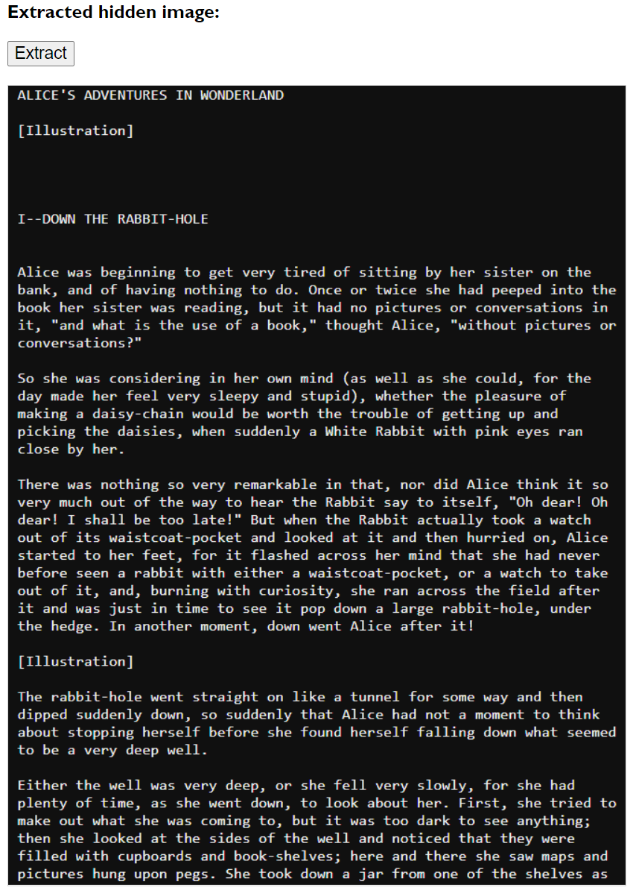

# Extra challenge: Hiding Data in Images with Steganography

This project is an extra challenge proposed in week 4 of the course "Programming Foundations with JavaScript, HTML and CSS" from Coursera (Duke University).

---------------------------

## Practicing Steganography with JavaScript 🔓

Steganography is the practice of hiding data (like secret messages) inside images.

The purpose of this challenge is to create a program that hides an image inside another image.

For each pixel of the image that will be used as a cover, the algorithm manipulates the RGB values ​​(in binary form), keeping the last 4 digits and replacing the first 4 digits with 0s. E.g.: a pixel with a red value of 1110 0110 would be 0000 0110.

Then, for each pixel of the image that will be hidden, its RGB values ​​will be replaced by moving the 4 left digits to the right and changing the last 4 digits to 0s. E.g.: a pixel with a red value of 1101 1100 would be 1100 0000.

Finally, the RGB values ​​of the merged image will be calculated by adding the changed values ​​of the displayed image (0000 0110) and the hidden image (1100 0000). Using the red value of the pixels above as an example, the red value of a given pixel in the merged image would be 1100 0110:

0000 0110 + 1100 0000 = 1100 0110

Another thing the program does is change the size of the merged image to the size of the hidden image in case the displayed image is larger or smaller than the hidden one, causing no hidden image data to be lost.

The extracted hidden image is of a lower quality than the original version of that same image.

|  |
| :--: |
| *Choosing an image to use as a cover* |

|  |
| :--: |
| *Choosing an image to hide* |

|  |
| :--: |
| *Cropping the displayed image to have the same dimension as the hidden image* |

|  |
| :--: |
| *Merged image (shown image + hidden image)* |

|  |
| :--: |
| *The hidden image extracted (but in a lower quality)* |

[Try it!](https://yohanaff.github.io/hidding-data-in-images-with-steganography/)